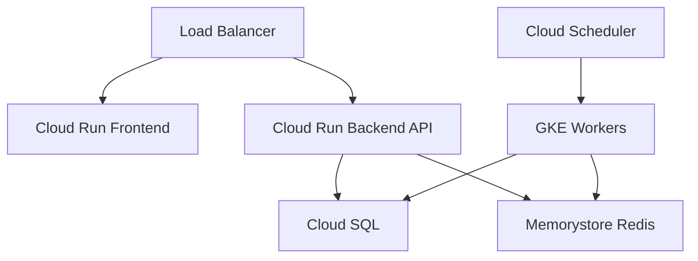
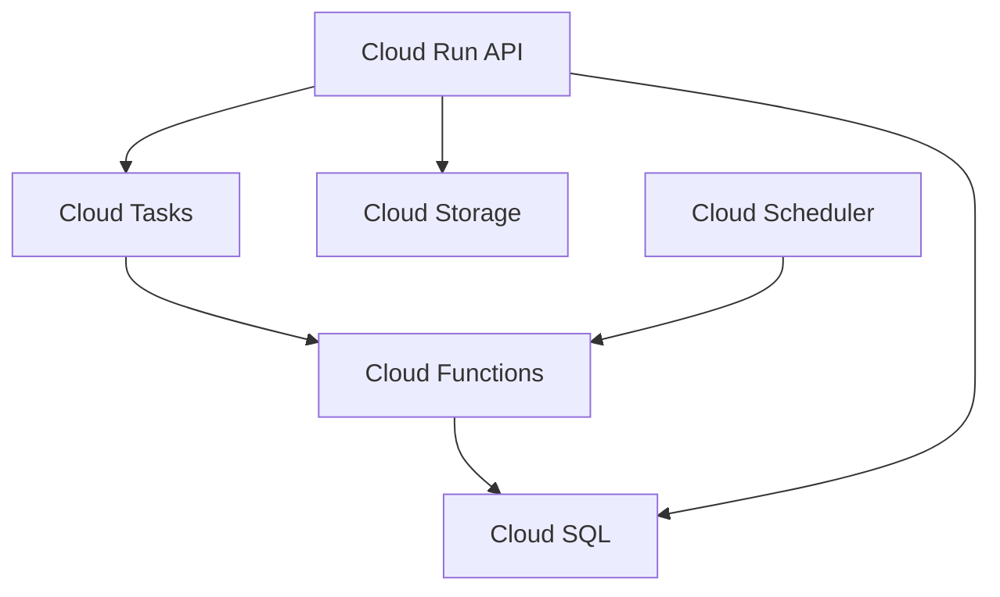

# ERPNext Cloud Run Feasibility Analysis

## Overview

This document analyzes the feasibility of deploying ERPNext on Google Cloud Run as an alternative to GKE, examining the benefits, limitations, and necessary architectural adjustments.

## 🏗️ Cloud Run Architecture Overview

Cloud Run is Google Cloud's fully managed serverless platform for containerized applications. It automatically scales from zero to thousands of instances based on incoming requests.

### Key Characteristics
- **Serverless**: No infrastructure management required
- **Auto-scaling**: Scales to zero when not in use
- **Pay-per-use**: Only pay for actual request processing time
- **Stateless**: Designed for stateless applications
- **Request-driven**: Optimized for HTTP request/response patterns

## 🔍 ERPNext Architecture Analysis

### Current ERPNext Components
1. **Frontend (Nginx)**: Serves static assets and proxies requests
2. **Backend (Gunicorn/Python)**: Main application server
3. **WebSocket Service**: Real-time communications
4. **Queue Workers**: Background job processing
5. **Scheduler**: Cron-like scheduled tasks
6. **Database (MariaDB)**: Persistent data storage
7. **Redis**: Caching and queue management

### Stateful vs Stateless Components

#### ✅ Cloud Run Compatible
- **Frontend (Nginx)**: Can be adapted for Cloud Run
- **Backend API**: HTTP requests can work with modifications

#### ⚠️ Challenging for Cloud Run
- **WebSocket Service**: Long-lived connections problematic
- **Queue Workers**: Background processing doesn't fit request/response model
- **Scheduler**: Cron jobs need alternative implementation
- **File Storage**: Local file system not persistent

#### ❌ Not Cloud Run Compatible
- **Database**: Requires external managed service (Cloud SQL)
- **Redis**: Requires external service (Memorystore)

## 🚦 Feasibility Assessment

### ✅ What Works Well

1. **Web Interface**: ERPNext's web UI can work on Cloud Run
2. **API Endpoints**: REST API calls fit the request/response model
3. **Cost Efficiency**: Pay only for active usage
4. **Auto-scaling**: Handles traffic spikes automatically
5. **Zero Maintenance**: No server management required

### ⚠️ Significant Challenges

1. **File Storage**: ERPNext expects local file system
   - **Solution**: Use Cloud Storage with custom adapters

2. **Background Jobs**: Queue workers don't fit Cloud Run model
   - **Solution**: Use Cloud Tasks or Cloud Functions

3. **WebSocket Support**: Limited WebSocket support in Cloud Run
   - **Solution**: Use alternative real-time solutions or accept limitations

4. **Cold Starts**: ERPNext has significant startup time
   - **Solution**: Keep minimum instances warm

5. **Database Connections**: ERPNext uses persistent DB connections
   - **Solution**: Use connection pooling with Cloud SQL Proxy

### ❌ Major Blockers

1. **Scheduled Tasks**: ERPNext scheduler cannot run on Cloud Run
2. **File System Persistence**: ERPNext writes to local filesystem
3. **Long-running Processes**: Queue workers run indefinitely
4. **Session Management**: Complex session handling

## 🔧 Required Architectural Changes

### 1. File Storage Adaptation

```python
# Current ERPNext file handling
frappe.attach_file("/path/to/file", doc)

# Cloud Run adaptation needed
# Use Cloud Storage with custom hooks
def cloud_storage_adapter(file_data):
    # Upload to Cloud Storage
    # Update database with Cloud Storage URL
    pass
```

### 2. Background Job Processing

```yaml
# Replace queue workers with Cloud Tasks
apiVersion: cloudtasks.googleapis.com/v1
kind: Queue
metadata:
  name: erpnext-tasks
spec:
  rateLimits:
    maxDispatchesPerSecond: 100
    maxConcurrentDispatches: 1000
```

### 3. Scheduled Tasks Alternative

```yaml
# Use Cloud Scheduler instead of ERPNext scheduler
apiVersion: cloudscheduler.googleapis.com/v1
kind: Job
metadata:
  name: erpnext-daily-tasks
spec:
  schedule: "0 2 * * *"
  httpTarget:
    uri: https://erpnext-service.run.app/api/method/frappe.utils.scheduler.execute_all
    httpMethod: POST
```

## 📋 Cloud Run Implementation Strategy

### Phase 1: Basic Web Interface

1. **Frontend Service**
   ```dockerfile
   FROM nginx:alpine
   COPY sites /usr/share/nginx/html
   COPY nginx.conf /etc/nginx/nginx.conf
   EXPOSE 8080
   ```

2. **Backend Service**
   ```dockerfile
   FROM frappe/erpnext-worker:v14
   # Modify for stateless operation
   # Remove queue worker startup
   # Configure for Cloud SQL connection
   EXPOSE 8080
   CMD ["gunicorn", "--bind", "0.0.0.0:8080", "frappe.app:application"]
   ```

### Phase 2: External Services Integration

1. **Cloud SQL Setup**
   ```bash
   gcloud sql instances create erpnext-db \
     --database-version=MYSQL_8_0 \
     --tier=db-n1-standard-2 \
     --region=us-central1
   ```

2. **Memorystore Redis**
   ```bash
   gcloud redis instances create erpnext-redis \
     --size=1 \
     --region=us-central1 \
     --redis-version=redis_6_x
   ```

### Phase 3: Background Processing

1. **Cloud Tasks for Jobs**
   ```python
   from google.cloud import tasks_v2
   
   def enqueue_job(method, **kwargs):
       client = tasks_v2.CloudTasksClient()
       task = {
           'http_request': {
               'http_method': tasks_v2.HttpMethod.POST,
               'url': f'{CLOUD_RUN_URL}/api/method/{method}',
               'body': json.dumps(kwargs).encode()
           }
       }
       client.create_task(parent=queue_path, task=task)
   ```

2. **Cloud Functions for Scheduled Tasks**
   ```python
   def scheduled_task(request):
       # Execute ERPNext scheduled methods
       # Call Cloud Run service endpoints
       pass
   ```

## 💰 Cost Comparison

### Cloud Run Costs (Estimated Monthly)
```
Frontend Service:
- CPU: 1 vCPU × 50% util × 730 hours = $26.28
- Memory: 2GB × 50% util × 730 hours = $7.30
- Requests: 100k requests = $0.40
Total Frontend: ~$34

Backend Service:
- CPU: 2 vCPU × 60% util × 730 hours = $63.07
- Memory: 4GB × 60% util × 730 hours = $17.52
- Requests: 50k requests = $0.20
Total Backend: ~$81

External Services:
- Cloud SQL (db-n1-standard-2): $278
- Memorystore Redis (1GB): $37
- Cloud Storage (100GB): $2

Total Estimated Monthly Cost: ~$432
```

### GKE Costs (Comparison)
```
GKE Cluster Management: $72.50/month
3 × e2-standard-4 nodes: ~$420/month
Persistent Storage: ~$50/month
Load Balancer: ~$20/month

Total GKE Cost: ~$562/month
```

**Potential Savings**: ~$130/month (23% cost reduction)

## 🎯 Recommendation Matrix

### ✅ Cloud Run is Suitable If:

- **Simple ERP Usage**: Basic CRUD operations, reporting
- **Low Background Processing**: Minimal custom workflows
- **Cost Sensitive**: Budget constraints are primary concern
- **Variable Traffic**: Highly seasonal or intermittent usage
- **Development/Testing**: Non-production environments

### ❌ Cloud Run is NOT Suitable If:

- **Heavy Customization**: Extensive custom apps with background jobs
- **Real-time Features**: Heavy use of WebSocket features
- **File-heavy Workflows**: Lots of document/image processing
- **Complex Integrations**: Custom scheduled tasks and workflows
- **High Performance**: Need consistent sub-second response times

## 🔄 Hybrid Approach

### Option 1: Partial Cloud Run Migration



**Components:**
- **Cloud Run**: Frontend + API endpoints
- **GKE**: Queue workers + scheduled tasks
- **Managed Services**: Cloud SQL + Memorystore

### Option 2: Event-Driven Architecture



**Components:**
- **Cloud Run**: Main application
- **Cloud Functions**: Background job processing
- **Cloud Tasks**: Job queue management
- **Cloud Scheduler**: Scheduled tasks

## 🚀 Implementation Roadmap

### Phase 1: Assessment (2 weeks)
1. Audit current ERPNext customizations
2. Identify background job dependencies
3. Test basic Cloud Run deployment
4. Measure performance baselines

### Phase 2: Proof of Concept (4 weeks)
1. Deploy read-only ERPNext on Cloud Run
2. Implement Cloud Storage file adapter
3. Test basic CRUD operations
4. Benchmark performance and costs

### Phase 3: Background Processing (6 weeks)
1. Implement Cloud Tasks integration
2. Migrate scheduled tasks to Cloud Scheduler
3. Test job processing workflows
4. Implement monitoring and alerting

### Phase 4: Production Migration (4 weeks)
1. Full data migration
2. DNS cutover
3. Performance optimization
4. Documentation and training

## 🔍 Decision Framework

### Technical Readiness Checklist

- [ ] ERPNext version compatibility assessment
- [ ] Custom app background job inventory
- [ ] File storage usage analysis
- [ ] WebSocket feature usage evaluation
- [ ] Performance requirements definition

### Business Readiness Checklist

- [ ] Cost-benefit analysis completed
- [ ] Stakeholder buy-in obtained
- [ ] Migration timeline approved
- [ ] Rollback plan prepared
- [ ] Team training planned

## 📊 Success Metrics

### Performance Metrics
- **Response Time**: < 2 seconds for 95% of requests
- **Availability**: 99.9% uptime
- **Scalability**: Handle 10x traffic spikes

### Cost Metrics
- **Monthly Savings**: Target 20%+ reduction
- **Operational Overhead**: Reduce maintenance time by 50%

### Feature Metrics
- **Functionality Parity**: 95%+ feature compatibility
- **User Satisfaction**: No degradation in user experience

## 🎯 Final Recommendation

### For Most Organizations: **Stick with GKE**

ERPNext's architecture is fundamentally designed for traditional server environments. The significant development effort required to make it Cloud Run compatible, combined with feature limitations, makes GKE the recommended approach for most production deployments.

### Cloud Run Makes Sense For:

1. **Development/Testing**: Temporary environments
2. **API-Only Deployments**: Headless ERPNext integrations
3. **Proof of Concepts**: Quick demos and trials
4. **Cost-Constrained Projects**: Where savings justify limitations

### Hybrid Approach Recommendation:

Consider a **hybrid model** where:
- **Frontend/API** runs on Cloud Run for cost optimization
- **Background processing** remains on GKE/Cloud Functions
- **Database/Cache** uses managed services

This provides cost benefits while maintaining full functionality.

---

**Next Steps**: If proceeding with Cloud Run, start with Phase 1 assessment and proof of concept before committing to full migration.